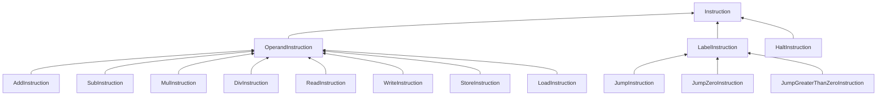
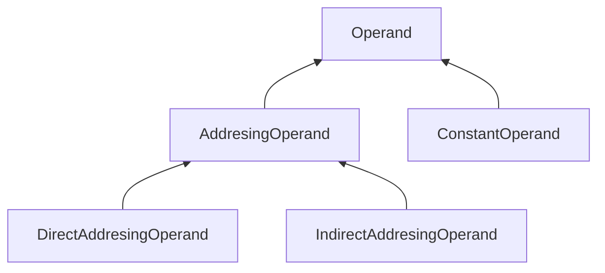

# Arquitectura de clases del programa.

Para desarrollar esta práctica, hemos seguido de la forma más fiel posible tanto los [`principios SOLID`](https://profile.es/blog/principios-solid-desarrollo-software-calidad/) como el [`patrón estrategia`](https://refactoring.guru/es/design-patterns/strategy), generando una estructura jerárquica la cual se detalla de forma más minuciosa en la siguiente lista:

- **RamMachine:** Clase desde la cual se ejecutan los programas, cuenta con una memoria de programa (ProgramMemory), una memoria de datos (DataMemory), una unidad de entrada (InputUnit) y una de salida (OutputUnit).

- **ProgramMemory:** Contiene un vector de punteros a instrucciones (Intruction\*), y se encarga de parsear el programa de entrada y validar y ejecutar las intrucciones.

- **DataMemory:** Almacena un conjunto de **32** registros donde se almacenará la información durante la ejecución.

- **InputUnit:** Encargada de leer desde la cinta de entrada cada uno de los elementos.

- **OutputUnit:** Su deber es encapsular la cinta de salida para interactuar con ella por medio de esta clase.

- **MachineError:** Clase derivada de la clase estándar de errores de `C++` para manejar cada una de las excepciones controladas de la máquina.

- **Instruction:** Clase abstracta de la que derivan todas las instrucciones. Se encarga de dotar de métodos nulos para seguir los pasos de la ejecución de cada instrucción, así como validar los operandos de la misma. La jerarquía de herencia implementada por esta familia de clases es la siguiente:

- **Operand:** Clase abstracta de la que derivan todos los operandos. Sigue los mismos principios de encapsulamiento y polimorfismo que la clase instruction. Su esquema jerárquico es el siguiente:

